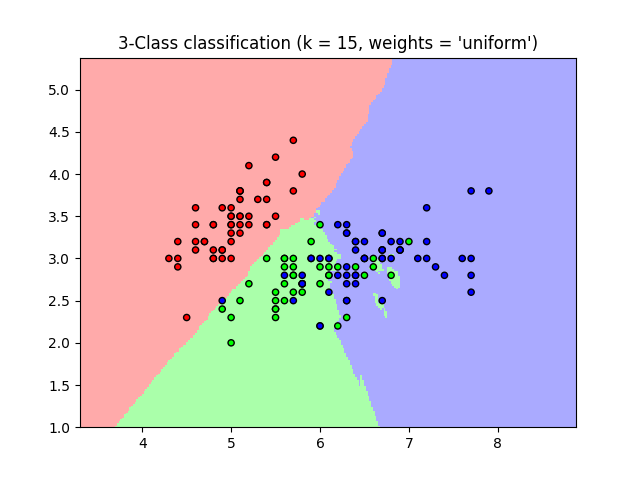
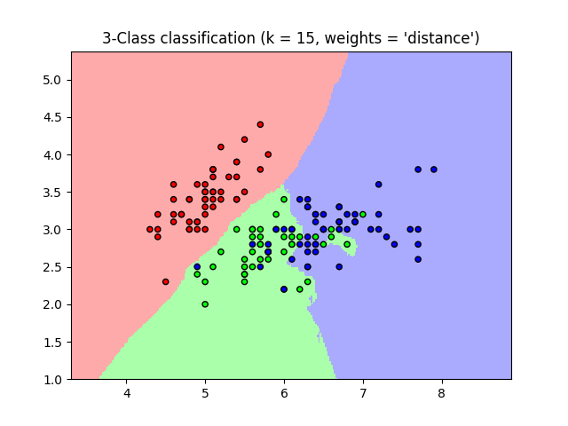

K Nearest Neighbors
==================================================

There are two implementations of K Nearest Neighbors, a Classification based
model, and a Regression based one. The KNN Classifier is used to classify labels
which take on Ordinal or Nominal values. Regression is used for Real valued labels.

Regression Model
-----------------------------
The following code calculates the distances between points of data
using euclidean distance.

.. code-block::

    from sklearn.neighbors import NearestNeighbors
    from sklearn.model_selection import train_test_split
    import numpy as np

    X = np.random.random(100)
    y = np.random.random(100)
    X_train, X_test, y_train, y_test = train_test_split(X, y, test_size=0.33, random_state=42)
    training_data = np.array([X_train, y_train]).T
    test_data = np.array([X_test, y_test]).T

    nbrs = NearestNeighbors(n_neighbors=2, algorithm='ball_tree').fit(training_data)
    distances, indices = nbrs.kneighbors(test_data)

It uses Euclidian distance
by default, although you can change this (metric='minkowski', p=2).

.. code-block::

    from sklearn.neighbors import KNeighborsRegressor
    from sklearn.model_selection import train_test_split
    import numpy as np
    from sklearn.datasets import load_iris

    iris_dataset = load_iris()
    X_train, X_test, y_train, y_test = train_test_split(iris_dataset.data, iris_dataset.target, test_size=0.33, random_state=42)

    # Weights is either (uniform, distance)
    neigh = KNeighborsRegressor(n_neighbors=3, weights='distance')
    neigh.fit(X_train, y_train)
    neigh.predict(X_test)
    neigh.score(X_test, y_test)
    0.980186461563154

98% of the time, K-Nearest Neighbors predicts the correct flower.

Plotting Decision Boundaries
~~~~~~~~~~~~~~~~~~~~~~~~~~~~~~

Taken from `sklearn docs <https://scikit-learn.org/stable/auto_examples/neighbors/plot_classification.html#sphx-glr-auto-examples-neighbors-plot-classification-py>`_

.. code-block::

    import numpy as np
    import matplotlib.pyplot as plt
    from matplotlib.colors import ListedColormap
    from sklearn import neighbors, datasets

    n_neighbors = 15

    # import some data to play with
    iris = datasets.load_iris()

    # we only take the first two features. We could avoid this ugly
    # slicing by using a two-dim dataset
    X = iris.data[:, :2]
    y = iris.target

    h = .02  # step size in the mesh

    # Create color maps
    cmap_light = ListedColormap(['#FFAAAA', '#AAFFAA', '#AAAAFF'])
    cmap_bold = ListedColormap(['#FF0000', '#00FF00', '#0000FF'])

    for weights in ['uniform', 'distance']:
        # we create an instance of Neighbours Classifier and fit the data.
        clf = neighbors.KNeighborsClassifier(n_neighbors, weights=weights)
        clf.fit(X, y)

        # Plot the decision boundary. For that, we will assign a color to each
        # point in the mesh [x_min, x_max]x[y_min, y_max].
        x_min, x_max = X[:, 0].min() - 1, X[:, 0].max() + 1
        y_min, y_max = X[:, 1].min() - 1, X[:, 1].max() + 1
        xx, yy = np.meshgrid(np.arange(x_min, x_max, h),
                             np.arange(y_min, y_max, h))
        Z = clf.predict(np.c_[xx.ravel(), yy.ravel()])

        # Put the result into a color plot
        Z = Z.reshape(xx.shape)
        plt.figure()
        plt.pcolormesh(xx, yy, Z, cmap=cmap_light)

        # Plot also the training points
        plt.scatter(X[:, 0], X[:, 1], c=y, cmap=cmap_bold,
                    edgecolor='k', s=20)
        plt.xlim(xx.min(), xx.max())
        plt.ylim(yy.min(), yy.max())
        plt.title("3-Class classification (k = %i, weights = '%s')"
                  % (n_neighbors, weights))

    plt.show()

Logistical classification
----------------------------

The following code predicts the label for test data. It uses Euclidian distance
by default, although you can change this (metric='minkowski', p=2).

.. code-block::

    from sklearn.neighbors import KNeighborsClassifier
    from sklearn.model_selection import train_test_split
    from sklearn.datasets import load_iris
    import numpy as np

    # Load Data
    iris_dataset = load_iris()
    X_train, X_test, y_train, y_test = train_test_split(iris_dataset.data, iris_dataset.target, test_size=0.33, random_state=42)

    # Weights is either (uniform, distance)
    neigh = KNeighborsClassifier(n_neighbors=3, weights='uniform')
    neigh.fit(X_train, y_train)
    neigh.predict(X_test)
    neigh.score(X_test, y_test)
    >> 0.98

In the above example, the model predicts Iris Flower Labels with 98% using the
test data.
