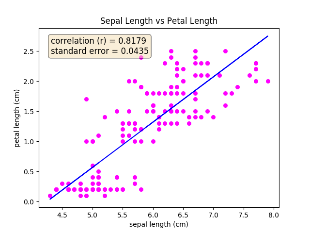

Linear Regression
==================================================

Linear Regression Using SciPy
-----------------------------

This computes a least-squares regression for two sets of measurements. L2Loss Minimization.

.. code-block:: python

   from scipy import stats
   import numpy as np
   x = np.random.random(10)
   y = np.random.random(10)
   slope, intercept, r_value, p_value, std_err = stats.linregress(x,y)
   print("Correlation coefficient R^2 = {}".format(r_value))

slope
    Also known as the Weight of the feature.

intercept
    Also known as the bias.

r_value
    correlation coefficient

p-value
    two-sided p-value for a hypothesis test whose null hypothesis is that the slope is zero.

stderr
    Standard error of the estimate

This process can be generalized to other loss functions using gradient descent.

Residual Analysis and Loss Functions
~~~~~~~~~~~~~~~~~~~~~~~~~~~~~~~~~~~~~~
The difference between the observed value and the predicted value is called the
*residual*. Minimizing the residual is equivalent to minimizing the error in our
model for the observed values. The residual is expressed as

Residual = Observed value - Predicted value

.. math::
  e = y(x) - \hat y(x)

For a multivariate sample with multiple features, we replace x with the
feature vector of the ith sample, as usual

.. math::
  e_i = y(\vec x_i) - \hat y(\vec x_i)

  = y_i - \hat y_i

This gives us the ith residual. Each sample has its own residual.
When finding a line of best fit for the data, the residual has has the following
properties

* The sum of residuals over the entire dataset is zero
.. math::
  \sum_{i=1}^{n}e_i = 0

* Consequently, the mean of residuals is therefore zero
.. math::
  \bar e = 0

A `loss function <https://blog.algorithmia.com/introduction-to-loss-functions/>`_
calculates the error in our prediction by calculating
the difference between our predicted Label and the true Label. The
concept of a loss function is integral to Machine Learning since minimizing
loss is synonymous with our model learning the ideal parameters.

Plotting A Linear Regression
----------------------------

.. code-block:: python

   from scipy import stats
   import numpy as np
   import matplotlib.pyplot as plt
   from sklearn.datasets import load_iris

   # Load Data
   iris_dataset = load_iris()
   sepal_length, petal_length = iris_dataset.data[:, 0], iris_dataset.data[:, 3]
   # Simple Regression Line
   slope, intercept, r_value, p_value, std_err = stats.linregress(sepal_length, petal_length)
   regression_line = intercept + slope * sepal_length

   # The Plot
   fig, ax = plt.subplots(1,1)
   ax.scatter(sepal_length, petal_length, color='magenta', marker='o', s=30)
   ax.plot(sepal_length, regression_line, color='blue')
   ax.set_xlabel('sepal length (cm)')
   ax.set_ylabel('petal length (cm)')
   ax.set_title('Sepal Length vs Petal Length')
   textstr = '\n'.join((
       r'correlation (r) = {:.4f}'.format(r_value),
       r'standard error = {:.4f}'.format(std_err)))
   props = dict(boxstyle='round', facecolor='wheat', alpha=0.5)
   ax.text(0.05, 0.95, textstr, transform=ax.transAxes, fontsize=12, verticalalignment='top', bbox=props)
   plt.show()

